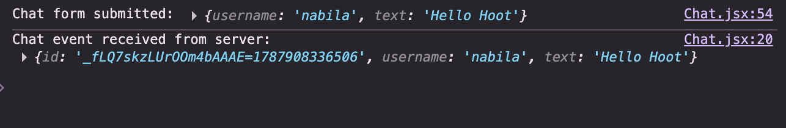
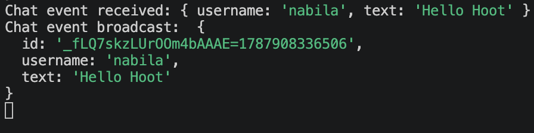

<h1>
  <span class="headline">WebSockets with Socket.IO</span>
  <span class="subhead">Broadcast a Chat Event</span>
</h1>

**Learning objective:** By the end of this lesson, students will be able to broadcast a server event to every connected client and verify the returned data in the browser console.

## Add the return direction

We have verified this direction:

```plaintext
React -> Express
```

Now we will add and test:

```plaintext
Express -> every connected React client
```

Messages still will not render on the page. First, every browser will log the server's event.

## Create the server's message object

Open `server.js` in the back-end.

Update the `chat message` listener:

```javascript
socket.on('chat message', (messageData) => {
  console.log('Chat event received:', messageData)

  // add this insde the listener
  const newMessage = {
    id: `${socket.id}-${Date.now()}`,
    username: messageData.username,
    text: messageData.text,
  }
  
  console.log('Chat event broadcast:', newMessage)

  io.emit('chat message', newMessage)
})
```

## Why create a new object?

The client sent this shape:

```javascript
{
  username: 'nabila',
  text: 'Hello Hoot!',
}
```

The server adds an `id`:

```javascript
{
  id: 'socket-id-1720000000000',
  username: 'nabila',
  text: 'Hello Hoot!',
}
```

React will later use `id` as a `key` when rendering the list.

The ID combines:

- `socket.id`, which identifies the sending connection during this session.
- `Date.now()`, which provides the current time as a number.

This is adequate for a temporary classroom chat. A persistent production message would normally receive an ID from the database.

## Why use `io.emit()`?

On the server:

```javascript
io.emit('chat message', newMessage)
```

sends the event to every connected socket, including the sender.

<!-- Compare three common choices:

| Server code | Recipients |
| --- | --- |
| `socket.emit(...)` | Only the current socket. |
| `socket.broadcast.emit(...)` | Every connected socket except the current socket. |
| `io.emit(...)` | Every connected socket, including the current socket. |

We want the sender to receive the server-approved `newMessage` object just like everyone else, so we use `io.emit()`. -->

## Listen in React

Open `src/pages/Chat.jsx`.

Inside the `useEffect`, define one more named handler:

```javascript
const handleChatMessage = (newMessage) => {
  console.log('Chat event received from server:', newMessage)
}
```

Register it before calling `socket.connect()`:

```javascript
socket.on('connect', handleConnect)
socket.on('disconnect', handleDisconnect)
socket.on('chat message', handleChatMessage)

socket.connect()
```

Remove it during cleanup:

```javascript
return () => {
  console.log('Leaving chat and closing socket')
  socket.off('connect', handleConnect)
  socket.off('disconnect', handleDisconnect)
  socket.off('chat message', handleChatMessage)
  socket.disconnect()
}
```

The complete effect at this checkpoint is:

```javascript
useEffect(() => {
    const handleConnect = () => {
        console.log('Connected to chat: ', socket.id)
        setIsConnected(true)
    }   

    const handleDisconnect = () => {
        console.log('Disconnected from chat')
        setIsConnected(false)
    }

    const handleChatMessage = (newMessage) => {
        console.log('Chat event received from server: ', newMessage)
    }

    socket.on('connect', handleConnect)
    socket.on('disconnect', handleDisconnect)
    socket.on('chat message', handleChatMessage)

    socket.connect()

    return () => {
        console.log('Leaving chat and closing socket')
        socket.off('connect', handleConnect)
        socket.off('disconnect', handleDisconnect)
        socket.off('chat message', handleChatMessage)
        socket.disconnect()
    }
}, [])
```

## Stop and check in one browser

Refresh your React page.  Then submit a message from Chat.

You should now see four stages across the console.logs:

1. Browser: `Chat form submitted`
2. Server: `Chat event received`
3. Server: `Chat event broadcast`
4. Browser: `Chat event received from server`

The returned object should include the new `id` created by Express.




## Stop and check in two browsers

Open Chat in a second browser tab. Both tabs can use the same signed-in user for this first test.

Each browser tab creates a separate socket connection. Check the Express terminal and confirm that it shows two different socket IDs.

Now submit a message from the first tab.

Expected results:

- The first tab logs the returned `chat message` event.
- The second tab logs the same returned event immediately.
- The Express terminal logs only one incoming message and one broadcast.

Submit a second message from the other tab. Both tabs should again receive it.

This is our first proof that the server is broadcasting in real time.

> To test two different usernames, use a regular browser window and a private/incognito window, then sign in with a separate Hoot account in each. Regular tabs share `localStorage`, so they normally share the same signed-in user.

<!-- ## Trace the matching pair

```javascript
// Express sends to everyone
io.emit('chat message', newMessage)

// Each React client receives
socket.on('chat message', (newMessage) => {
  // use newMessage
})
```

The client-to-server event and server-to-client event happen to use the same name. This is allowed, but they are two separate emissions in two separate directions. -->
