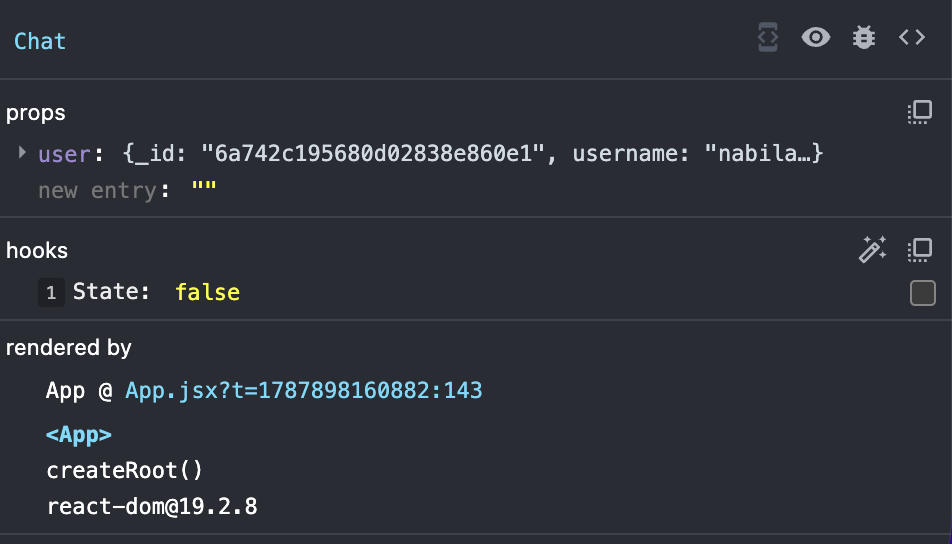

<h1>
  <span class="headline">WebSockets with Socket.IO</span>
  <span class="subhead">Connect the React Client</span>
</h1>

**Learning objective:** By the end of this lesson, students will be able to build a Chat page, connect it to a route, and then add and test one part of a Socket.IO connection at a time.

## Build the page before building the connection

There are two things we're trying to accomplish:

1. Make a normal React page that users can visit.
2. Give that page a socket connection.


## Scaffold the Chat page

Move to the `react-hoot-front-end` project.

Create a new page component:

```bash
touch src/pages/Chat.jsx
```

Add only the basic component scaffolding:

```javascript
// src/pages/Chat.jsx

const Chat = () => {
  return (
    <main>
      <h1>Hoot Chat</h1>
    </main>
  )
}

export default Chat
```

There is no socket code yet. First, we need to prove that React can render this component.

## Import Chat into App

Open `src/App.jsx`.

Add an import beside the other page imports:

```javascript
// src/App.jsx

import Chat from './pages/Chat'
```

### Add the protected route

Find the group of routes available to signed-in users.

Add one route inside that group:

```javascript
<Route path='/chat' element={<Chat user={user} />} />
```

We pass `user` as a prop now because the chat form will use `user.username` in the next section. The scaffolded Chat component does not use it yet.

Keep all the other routes already present in your application.

### Add a navigation link

Open the `Nav` component.

Inside the list of links shown to a signed-in user, add:

```javascript
<li><Link to='/chat'>CHAT</Link></li>
```

Do not add this link to the guest navigation list.

Click the new **CHAT** link.  You should your `Chat` page.

Now we are ready to add Socket.IO.

## Create the socket object

Create a file directly inside `src`:

```bash
touch src/socket.js
```

First, import `io` from the client package:

```javascript
// src/socket.js

import { io } from 'socket.io-client'
```

Next, get the existing back-end URL from the Vite environment variable:

```javascript
const BACK_END_URL = import.meta.env.VITE_BACK_END_SERVER_URL
```

Now create the socket object:

```javascript
const socket = io(BACK_END_URL, {
  autoConnect: false,
})
```

Finally, export it:

```javascript
export default socket
```

The completed file is short:

```javascript
// src/socket.js

import { io } from 'socket.io-client'

const BACK_END_URL = import.meta.env.VITE_BACK_END_SERVER_URL

const socket = io(BACK_END_URL, {
  autoConnect: false,
})

export default socket
```

## Why use `autoConnect: false`?

Normally, Socket.IO connects as soon as `io()` creates the socket object.

We turn that behavior off so our code can clearly say:

> Connect when the user opens Chat.


## Import the socket into Chat

Open `src/pages/Chat.jsx` and add:

```javascript
import socket from '../socket'
```

Temporarily log the socket's current connection value inside the component:

```javascript
const Chat = () => {
  console.log('socket.connected:', socket.connected)

  return (
    <main>
      <h1>Hoot Chat</h1>
    </main>
  )
}
```

### Stop and check the socket value

Open the browser console and visit Chat.

You should see:

```plaintext
socket.connected: false
```

This is correct. The socket object exists, but we have not connected it.

Remove the temporary `console.log()` after checking it.

## Store the connection status in state

We want the page to display whether the connection is open. Because the display must change, React needs state.

Import `useState`:

```javascript
import { useState } from 'react'
import socket from '../socket'
```

Add the state inside the component:

```javascript
const [isConnected, setIsConnected] = useState(socket.connected)
```

There are now two similarly named values:

| Value | Owned by | Purpose |
| --- | --- | --- |
| `socket.connected` | Socket.IO | Reports the socket's current connection value. |
| `isConnected` | React state | Lets React update the words shown on the page. |

The state begins with the socket's current value. At this moment, that value is `false`.  We can open our React Dev Tools to confirm the value of our state is false.



Update the JSX:

```javascript
return (
  <main>
    <h1>Hoot Chat</h1>
    <p>
      Status: {isConnected ? 'Connected' : 'Disconnected'}
    </p>
  </main>
)
```

The page should display:

```plaintext
Status: Disconnected
```

This does not mean our code is broken. We have not yet connected our socket - soon we will need to call `socket.connect()`.  But not yet 🙃.

## Add an effect for the connection

A connection is something **outside React** that must be synchronized with the Chat page. We will manage it with `useEffect`, just like how we make some of our API service calls inside of `useEffect`.

Update the React import:

```javascript
import { useEffect, useState } from 'react'
```

Start with an effect that only logs when Chat mounts (loads):

```javascript
useEffect(() => {
  console.log('Chat page mounted')
}, [])
```

### Stop and check the effect

1. Navigate away from Chat.
2. Clear the browser console.
3. Return to Chat.

You should see:

```plaintext
Chat page mounted
```

The empty dependency array means this effect belongs to the page being mounted. In React development mode, Strict Mode may run an extra setup check. Seeing the log twice during development does not mean two messages were sent.

Remove the temporary `Chat page mounted` log after checking the effect.

## Define what should happen after connecting

Inside the effect, define a function named `handleConnect`:

```javascript
useEffect(() => {
  const handleConnect = () => {
    console.log('Connected to chat:', socket.id)
    setIsConnected(true)
  }
}, [])
```

This function has two jobs:

1. Log the temporary ID of this browser connection.
2. Change the React state to `true` so the page re-renders as connected.

### Stop and predict

Save the file and refresh Chat.

Will the page say `Connected` yet?

No. We have only **defined** the function. Nothing has called it.


## Register the connect listener

Below the function, tell the socket when to run it:

```javascript
socket.on('connect', handleConnect)
```

The effect now contains:

```javascript
useEffect(() => {
  const handleConnect = () => {
    console.log('Connected to chat:', socket.id)
    setIsConnected(true)
  }

  socket.on('connect', handleConnect)
}, [])
```

Read this line as:

> When this socket receives the `connect` event, run `handleConnect`.

The page should still say:

```plaintext
Status: Disconnected
```

We created a listener, but we still have not asked the socket to connect.

## Open the connection

After registering the listener, add:

```javascript
socket.connect()
```

The order is important:

```javascript
socket.on('connect', handleConnect)
socket.connect()
```

We first tell the socket what to do when it connects. Then we ask it to connect.

### Stop and check `handleConnect`

Check three places.

On the page, you should see:

```plaintext
Status: Connected
```

If you don't see `Connected` try refreshing your page.

In the browser console, you should see:

```plaintext
Connected to chat: Bb7WrY5jZwzjlVcXAAAE
```

In the Express terminal, you should see:

```plaintext
Socket connected: Bb7WrY5jZwzjlVcXAAAE
```

The exact ID will be different. The important check is that the **browser and server display the same ID as each other.**

This proves that:

- `socket.connect()` opened the connection.
- The socket produced a `connect` event.
- The registered listener called `handleConnect`.
- `handleConnect` changed React state.
- React re-rendered the visible status.

## Add the first cleanup

If the user leaves Chat, this page no longer needs its connection. We should remove the listener and disconnect.

Return a cleanup function from the effect:

```javascript
return () => {
  console.log('Leaving chat and closing socket')
  socket.off('connect', handleConnect)
  socket.disconnect()
}
```

The same named `handleConnect` function appears in both places:

```javascript
socket.on('connect', handleConnect)
socket.off('connect', handleConnect)
```

- `on` adds the listener.
- `off` removes the listener.

### Stop and check the cleanup

Refresh your page, then navigate from Chat to the Hoot list.

The browser console should show:

```plaintext
Leaving chat and closing socket
```

The Express terminal should show:

```plaintext
Socket disconnected: abc123...
```

Return to Chat. The socket should connect again.

## Define what should happen after disconnecting

The cleanup handles an intentional disconnection when the user leaves Chat. We also want the page to react if the server stops unexpectedly.

Inside the effect, below `handleConnect`, define another function:

```javascript
const handleDisconnect = () => {
  console.log('Disconnected from chat')
  setIsConnected(false)
}
```

This function changes the React state back to `false`.

Add:

```javascript
socket.on('disconnect', handleDisconnect)
```

The two listener registrations should now be together:

```javascript
socket.on('connect', handleConnect)
socket.on('disconnect', handleDisconnect)

socket.connect()
```

## Update the cleanup

Every `on` should have a matching `off`. Add the disconnect listener to the cleanup:

```javascript
return () => {
  console.log('Leaving chat and closing socket')
  socket.off('connect', handleConnect)
  socket.off('disconnect', handleDisconnect)
  socket.disconnect()
}
```

### Stop and check `handleDisconnect`

Refresh your page to register the new changes.  Keep the Chat page open and stop the Express server with `Control + C`.

The browser console should show:

```plaintext
Disconnected from chat
```

The page should change to:

```plaintext
Status: Disconnected
```

Restart Express:

```bash
npm run dev
```

Socket.IO should reconnect. `handleConnect` should run again, and the page should return to:

```plaintext
Status: Connected
```


Your final `Chat` code should look like this:

```jsx
import socket from '../socket'
import { useState, useEffect } from 'react'

const Chat = () => {
    const [isConnected, setIsConnected] = useState(socket.connected)

    useEffect(() => {
        const handleConnect = () => {
            console.log('Connected to chat: ', socket.id)
            setIsConnected(true)
        }   

        const handleDisconnect = () => {
            console.log('Disconnected from chat')
            setIsConnected(false)
        }

        socket.on('connect', handleConnect)
        socket.on('disconnect', handleDisconnect)

        socket.connect()

        return () => {
            console.log('Leaving chat and closing socket')
            socket.off('connect', handleConnect)
            socket.off('disconnect', handleDisconnect)
            socket.disconnect()
        }
    }, [])

    return (
        <main>
            <h1>Hoot Chat</h1>
            <p>
                Status: { isConnected ? 'Connected' : 'Disconnected'}
            </p>
        </main>
    )
}

export default Chat
```